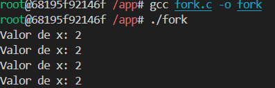

# S.O. 2025.1 - Atividade 03

Discente: Bernardo de Moura Medeiros
Data: 06/06/2025

---

## 1. Objetivo

Execução de códigos dentro do container Docker criando um ambiente isolado de desenvolvimento capaz de compilar e executar programas nas linguagens C e Java. Por meio do Dockerfile, foi possível montar imagens personalizadas com os compiladores gcc e javac, realizar o mapeamento de volumes entre o (Windows/Linux) e o container, e executar seus códigos diretamente dentro do ambiente fish.

## 2. Passo a passo

### Criando Imagem através do Dockerfile

Executei um Dockerfile criado com base nas informações da proposta da atividade. Contendo configurações necessárias para gerar uma imagem baseada na distro Fedora, incluindo compiladores para códigos C e Java. Assim, baixei a imagem base do Fedora e fiz a instalação de todos os pacotes solicitados no Dockerfile.

### Execução do Container

A partir da execução da imagem, o terminal fish foi inicializado, indicando que o ambiente isolado foi criado com sucesso.

### Compilação e execução de códigos

Uma vez que entrei no shell fish, compilei e executei códigos C e Java conforme citados no livro de suporte.

    
    
    
    

## 3. Conclusão
A prática foi extremamente útil para entender como o Docker pode ser utilizado para criar ambientes consistentes de desenvolvimento, especialmente em linguagens compiladas como C. A construção da imagem e o mapeamento do diretório facilitaram a organização e execução do código sem depender de configurações específicas do sistema operacional.

Esse tipo de solução pode ser usado em ambientes educacionais, projetos colaborativos e até em produção para garantir padronização no uso de ferramentas como compiladores, bibliotecas e outros utilitários.